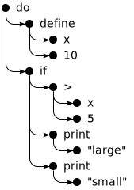

```js
do(define(x, 10),
   if(>(x, 5),
      print("large"),
      print("small")))
```

<div>
  
</div>

### The >(x, 5) part of the previous program would be represented like this:

```js
{
  type: "apply",
  operator: {type: "word", name: ">"},
  args: [
    {type: "word", name: "x"},
    {type: "value", value: 5}
  ]
}
```